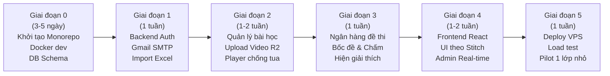

# 🏗️ KẾ HOẠCH KIẾN TRÚC HỆ THỐNG E-LEARNING GDQP&AN

> **Phiên bản:** 2.1 (Hoàn thiện — Đã chốt toàn bộ quyết định nghiệp vụ & kỹ thuật)  
> **Ngày cập nhật:** 01/10/2026  
> **Quy mô dự kiến:** ~5.000 sinh viên (~2.000–3.000 sinh viên đồng thời giờ cao điểm)  
> **Mô hình học tập:** **Thi theo từng bài** (Học video bài nào → Mở khóa làm quiz bài đó)  
> **Môi trường:** VPS Linux (Ubuntu 22.04 LTS) + Cloudflare R2 (Lưu video 0đ egress) + Nginx

---

## MỤC LỤC

1. [Quyết Định Kiến Trúc Đã Chốt (ADRs)](#1-quyết-định-kiến-trúc-đã-chốt-adrs)
2. [Tư Vấn Chi Phí & Cloud Free Tier (Giải Đáp Mục 10)](#2-tư-vấn-chi-phí--cloud-free-tier)
3. [Đề Xuất Phương Án Tên Miền (Giải Đáp Mục 17)](#3-đề-xuất-phương-án-tên-miền)
4. [Tech Stack Hệ Thống](#4-tech-stack-hệ-thống)
5. [Máy Trạng Thái Nghiệp Vụ (Theo Từng Bài Học)](#5-máy-trạng-thái-nghiệp-vụ)
6. [Thiết Kế Cơ Sở Dữ Liệu (MongoDB Schemas v2.1)](#6-thiết-kế-cơ-sở-dữ-liệu)
7. [Luồng Nghiệp Vụ Học Tập & Kiểm Tra](#7-luồng-nghiệp-vụ)
8. [Cơ Chế Video Player & Chống Gian Lận](#8-cơ-chế-video-player--chống-gian-lận)
9. [Ngân Hàng Câu Hỏi & Quy Chế Thi](#9-ngân-hàng-câu-hỏi--quy-chế-thi)
10. [Danh Mục API Endpoints](#10-danh-mục-api-endpoints)
11. [Cấu Trúc Mã Nguồn (Monorepo)](#11-cấu-trúc-mã-nguồn)
12. [Hạ Tầng Triển Khai & Vận Hành](#12-hạ-tầng-triển-khai--vận-hành)
13. [Lộ Trình Triển Khai 6 Giai Đoạn](#13-lộ-trình-triển-khai)

---

## 1. QUYẾT ĐỊNH KIẾN TRÚC ĐÃ CHỐT (ADRs)

| Mã ADR | Quyết định | Chi tiết & Căn cứ kỹ thuật |
|---|---|---|
| **ADR-01** | **Frontend: SPA (Vite + React 18 + TS)** | Hệ thống sau đăng nhập, không cần SEO. Nginx serve file tĩnh nhẹ, không tốn RAM chạy tiến trình Node riêng trên VPS. |
| **ADR-02** | **Backend: Express.js (Node LTS 22.x + TS)** | Kiến trúc controller-service tách biệt, chạy PM2 cluster mode. |
| **ADR-03** | **Cấu trúc: Học & Thi theo TỪNG BÀI** | Sinh viên xem video bài X (đạt ≥95% coverage) → Mở khóa làm trắc nghiệm bài X. Hoàn thành tất cả các bài = Hoàn thành môn học. |
| **ADR-04** | **Quy chế thi: Mở rộng, thân thiện** | Không giới hạn số lần thi, không cooldown giữa các lần, không giới hạn thời gian làm bài, được thi lại để nâng điểm (giữ điểm cao nhất), nộp xong hiển thị đáp án sai kèm giải thích. |
| **ADR-05** | **Phân quyền đơn giản** | Chỉ có 2 vai trò: `student` và `admin` (nhiều tài khoản admin quản trị đồng cấp, không phân superadmin). |
| **ADR-06** | **Xác thực & Email: Gmail SMTP** | Admin import danh sách sinh viên → Gửi link kích hoạt tài khoản qua Gmail (sử dụng Google App Password an toàn). |
| **ADR-07** | **Lưu trữ Video: Cloudflare R2** | Tận dụng chính sách **0đ phí băng thông ra (Zero Egress)** của Cloudflare, bảo mật bằng Token/Worker có thời hạn. |
| **ADR-08** | **Video Player & Chống tua** | Tối đa ~15 phút/video. Pipeline transcode HLS (m3u8), kiểm soát heartbeat theo block 5s (coverage bitmap) trên server. |
| **ADR-09** | **Cơ sở dữ liệu: MongoDB** | Chạy Replica Set (1 node trên VPS) để hỗ trợ Transaction an toàn khi nộp bài và Change Streams cho SSE. |
| **ADR-10** | **Real-time: SSE (Server-Sent Events) + Redis** | Admin xem kết quả sinh viên Đạt (✅) / Chưa đạt (❌) theo thời gian thực mà không cần reload trang. |

---

## 2. TƯ VẤN CHI PHÍ & CLOUD FREE TIER

> **Câu hỏi của bạn:** *Liệu có cloud nào free không? Chi phí hợp lý là bao nhiêu?*

### 2.1. Các dịch vụ Cloud có thể tận dụng Free Tier (0 VNĐ)

1. **Lưu trữ Video — Cloudflare R2 (Khuyên dùng tối đa):**
   - **Miễn phí 10 GB lưu trữ đầu tiên** mỗi tháng.
   - **HOÀN TOÀN MIỄN PHÍ BĂNG THÔNG TẢI VỀ (0$ Egress fee)**. Với các cloud khác (như AWS S3, Google Cloud), 5.000 sinh viên tải video có thể tốn hàng chục triệu tiền băng thông, nhưng R2 là 0 VNĐ.
   - Với các bài giảng tối đa ~15 phút (mỗi video 720p sau nén ~100MB), 10GB lưu được khoảng 70–100 bài giảng hoàn toàn miễn phí.
2. **Gửi Email Kích Hoạt — Gmail SMTP:**
   - Miễn phí tối đa **500 email/ngày** (với tài khoản cá nhân @gmail.com) hoặc **2.000 email/ngày** (Google Workspace trường). Sử dụng cơ chế gửi theo đợt (batching queue) là hoàn toàn đủ.
3. **Bảo mật CDN & Chống DDoS — Cloudflare Free:**
   - Miễn phí chứng chỉ SSL/TLS, ẩn IP gốc của máy chủ, chống bot và DDoS cơ bản.
4. **Cơ sở dữ liệu & Cache:**
   - Cài đặt trực tiếp **MongoDB Community** và **Redis (Valkey)** ngay trên VPS thay vì thuê dịch vụ managed đắt đỏ.

### 2.2. Chi phí bắt buộc duy nhất: Máy chủ VPS

Hệ thống cần 1 máy chủ VPS Linux (Ubuntu 22.04 LTS) để chạy Nginx, Express API, MongoDB và Redis:

| Cấu hình đề xuất | Nhu cầu sử dụng | Nhà cung cấp gợi ý | Chi phí ước tính |
|---|---|---|---|
| **2 vCPU - 4 GB RAM - 50 GB NVMe** | Giai đoạn thử nghiệm, làm nội dung, chạy pilot 1–2 lớp | Vietnix, TinoHost, TotHost, Vultr | **~150.000 – 220.000 VNĐ / tháng** |
| **4 vCPU - 8 GB RAM - 100 GB NVMe** *(Khuyên dùng)* | Chạy chính thức cho toàn bộ 5.000 sinh viên, tải đỉnh 2.000 online | Vietnix, Bizfly Cloud, Hetzner, OVH | **~350.000 – 500.000 VNĐ / tháng** |

👉 **Tổng ngân sách vận hành:** Chỉ khoảng **~300.000 – 500.000 VNĐ/tháng** (gần như chỉ mất tiền thuê VPS).

---

## 3. ĐỀ XUẤT PHƯƠNG ÁN TÊN MIỀN (DOMAIN)

> **Câu hỏi của bạn:** *Chưa có domain, chưa có dự tính, hãy đề xuất?*

Dưới đây là 3 phương án từ tối ưu nhất đến linh hoạt:

### Phương án 1: Xin Subdomain từ Trung tâm hoặc Trường Đại học (Tối ưu nhất — 0 VNĐ)
- **Dạng tên miền:** `elearning.gdqp.edu.vn` hoặc `hoctap.ttgdqpan.[tentruong].edu.vn`
- **Ưu điểm:**
  - **Miễn phí 100%**: Chỉ cần IT của trường trỏ 1 bản ghi DNS (A Record hoặc CNAME) về địa chỉ IP của VPS.
  - **Tăng độ tin cậy**: Sinh viên nhận ra ngay đuôi `.edu.vn` của trường, an tâm đăng nhập và không sợ web giả mạo.

### Phương án 2: Mua tên miền riêng độc lập
- **Dạng tên miền gợi ý:**
  - `elearning-gdqp.vn` hoặc `gdqpan-online.vn` (Tên miền quốc gia `.vn`: ~450.000 – 550.000 VNĐ/năm).
  - `elearning-gdqpan.com` (Tên miền quốc tế `.com`: ~250.000 – 300.000 VNĐ/năm, mua tại Namecheap, Cloudflare, inet.vn).
- **Ưu điểm:** Chủ động 100%, không cần chờ thủ tục xin phép IT nhà trường.

### Phương án 3: Giai đoạn thử nghiệm (Chưa cần mua domain)
- Trong thời gian code và chạy thử, ta có thể dùng:
  - **IP trực tiếp** của VPS (kèm port).
  - **Cloudflare Tunnel (Tạo domain tạm miễn phí dạng `xxx.trycloudflare.com`)**: Có sẵn HTTPS bảo mật, chạy thử nghiệm trên điện thoại thoải mái mà chưa cần mua domain.

---

## 4. TECH STACK HỆ THỐNG

```
[Trình duyệt Mobile / Desktop]
            │ (HTTPS)
            ▼
   ┌─────────────────┐
   │ Cloudflare CDN  │ ──► Phân phối Video HLS từ Cloudflare R2 (0đ Egress)
   └────────┬────────┘
            ▼
┌───────────────────────┐
│ NGINX (Reverse Proxy) │
└───────┬───────┬───────┘
        │       │
 (/)    │       │ (/api/*)
        ▼       ▼
┌──────────────┐ ┌────────────────────────────────────────────────────────┐
│ React SPA    │ │ Express.js API (TypeScript, PM2 Cluster)               │
│ (Vite Build) │ │ - argon2id / JWT HttpOnly Cookie                       │
└──────────────┘ │ - Gmail SMTP Service (Nodemailer)                      │
                 │ - SSE Broadcaster (Real-time admin dashboard)          │
                 │ - ExcelJS (Import/Export sinh viên & điểm)             │
                 └─────────────────────────┬──────────────────────────────┘
                                           │
                        ┌──────────────────┴──────────────────┐
                        ▼                                     ▼
             ┌─────────────────────┐               ┌────────────────────┐
             │ MongoDB Replica Set │               │ Redis (Valkey)     │
             │ (Lưu trữ dữ liệu)   │               │ (Session/Heartbeat)│
             └─────────────────────┘               └────────────────────┘
```

---

## 5. MÁY TRẠNG THÁI NGHIỆP VỤ

### 5.1. Luồng Trạng Thái Từng Bài Học (`lesson_progress.status`)

Mỗi bài học là một chu trình khép kín: **Xem video → Làm bài trắc nghiệm bài đó**.

```
NOT_STARTED
    │
    │ (Sinh viên bấm xem video)
    ▼
WATCHING (Đang xem, heartbeat gửi mỗi 15s)
    │
    │ (Độ phủ xem đạt coveragePercent ≥ 95%)
    ▼
QUIZ_UNLOCKED (Mở khóa bài trắc nghiệm của bài học này)
    │
    │ (Bấm bắt đầu làm bài: POST /api/lessons/:id/quiz/start)
    ▼
QUIZ_IN_PROGRESS
    │
    │ (Sinh viên nộp bài: POST /api/lessons/:id/quiz/submit)
    ├─── Điểm ≥ Điểm đạt (Mặc định 8/10) ──► PASSED ✅ (Đạt bài học này)
    │                                             │
    └─── Điểm < Điểm đạt ──────────────────► FAILED ❌ (Chưa đạt)
                                                  │
    ┌─────────────────────────────────────────────┘
    │ (Sinh viên có thể bấm "Làm lại" ngay lập tức — Không cooldown)
    ▼
QUIZ_IN_PROGRESS
```

### 5.2. Luồng Hoàn Thành Môn Học Toàn Khóa (`enrollments.status`)

- Một khóa học có `N` bài học bắt buộc.
- Khi **tất cả các bài học đều đạt trạng thái `PASSED`** → Trạng thái khóa học chuyển thành **`COMPLETED` (ĐẠT MÔN HỌC)**.
- Sinh viên dù đã đạt vẫn có thể thi lại từng bài để nâng điểm. Hệ thống luôn giữ **điểm cao nhất**.

---

## 6. THIẾT KẾ CƠ SỞ DỮ LIỆU

### 6.1. `users` (Tài khoản)
```typescript
{
  _id: ObjectId,
  mssv: { type: String, unique: true, index: true, uppercase: true, trim: true }, // Mã sinh viên
  nameRaw: { type: String, required: true },               // Họ và tên tiếng Việt
  nameNormalized: { type: String, index: true },            // Không dấu, chữ thường (phục vụ tìm kiếm nhanh)
  email: { type: String, required: true, unique: true, lowercase: true, trim: true },
  passwordHash: String,                                     // argon2id hash
  role: { type: String, enum: ['student', 'admin'], default: 'student' }, // 2 vai trò đơn giản
  class: String,                                            // Lớp sinh hoạt (VD: "21DTH01")
  isActive: { type: Boolean, default: false },              // true khi đã kích hoạt qua mail
  activationToken: String,                                  // Token gửi qua Gmail
  activationExpires: Date,
  createdAt: Date,
  updatedAt: Date
}
```

### 6.2. `courses` (Khóa học / Học phần GDQP&AN)
```typescript
{
  _id: ObjectId,
  code: { type: String, unique: true, uppercase: true },     // VD: "GDQP01"
  title: { type: String, required: true },
  description: String,
  coverImageKey: String,
  totalLessons: { type: Number, default: 0 },
  active: { type: Boolean, default: true },
  createdAt: Date,
  updatedAt: Date
}
```

### 6.3. `lessons` (Bài học: Bao gồm Video & Cấu hình Quiz riêng của bài)
```typescript
{
  _id: ObjectId,
  courseId: { type: ObjectId, ref: 'Course', required: true, index: true },
  title: { type: String, required: true },                  // Tên bài (VD: "Bài 1: Đường lối quân sự...")
  order: { type: Number, required: true },                  // Thứ tự bài (1, 2, 3...)
  
  // Cấu hình Video
  videoKey: String,                                         // Đường dẫn file trên R2
  videoDurationSeconds: { type: Number, default: 0 },       // ffprobe tự đo (khoảng ≤ 15 phút)
  minCoveragePercent: { type: Number, default: 0.95 },      // Bắt buộc xem ≥ 95%
  
  // Cấu hình Quiz của bài này
  passScore: { type: Number, default: 8 },                  // Điểm đạt (VD: 8/10)
  totalQuestionsPerQuiz: { type: Number, default: 10 },     // Bốc ngẫu nhiên 10 câu của bài này
  
  active: { type: Boolean, default: true },
  createdAt: Date,
  updatedAt: Date
}
```

### 6.4. `questions` (Ngân hàng câu hỏi trắc nghiệm — Gắn theo Bài học)
```typescript
{
  _id: ObjectId,
  lessonId: { type: ObjectId, ref: 'Lesson', required: true, index: true }, // Thuộc bài học nào
  courseId: { type: ObjectId, ref: 'Course', required: true },
  text: { type: String, required: true },                   // Nội dung câu hỏi
  choices: [{
    id: { type: String, required: true },                   // "A", "B", "C", "D"
    text: { type: String, required: true }                  // Nội dung đáp án
  }],
  correctIds: [{ type: String, required: true }],            // ["A"] (Server giữ, không gửi xuống client)
  explanation: String,                                      // Giải thích đáp án (Gửi sau khi nộp)
  active: { type: Boolean, default: true }
}
```

### 6.5. `lesson_progress` (Tiến độ & Kết quả từng bài của sinh viên)
```typescript
{
  _id: ObjectId,
  userId: { type: ObjectId, ref: 'User', required: true },
  lessonId: { type: ObjectId, ref: 'Lesson', required: true },
  courseId: { type: ObjectId, ref: 'Course', required: true },

  // Video Progress
  coveredBlocks: [Number],                                  // Mảng các block 5s đã xem
  coveragePercent: { type: Number, default: 0 },
  videoCompleted: { type: Boolean, default: false },

  // Quiz Progress
  highestScore: { type: Number, default: 0 },               // Điểm cao nhất
  attemptsCount: { type: Number, default: 0 },              // Số lần thi
  passed: { type: Boolean, default: false, index: true },   // Đã đạt bài này chưa
  passedAt: Date,

  status: {
    type: String,
    enum: ['NOT_STARTED', 'WATCHING', 'QUIZ_UNLOCKED', 'PASSED', 'FAILED'],
    default: 'NOT_STARTED',
    index: true
  },
  updatedAt: Date
}
// Index duy nhất: { userId: 1, lessonId: 1 } (Unique)
```

### 6.6. `quiz_attempts` (Nhật ký từng lần làm bài kiểm tra của bài học)
```typescript
{
  _id: ObjectId,
  userId: { type: ObjectId, ref: 'User', required: true },
  lessonId: { type: ObjectId, ref: 'Lesson', required: true },
  courseId: { type: ObjectId, ref: 'Course', required: true },
  
  // Snapshot đề đã phát
  questionSnapshots: [{
    questionId: ObjectId,
    text: String,
    choices: [{ id: String, text: String }],
    selectedId: String,                                     // Đáp án sinh viên đã chọn
    isCorrect: Boolean,
    explanation: String
  }],

  score: Number,                                            // Điểm đạt được lần này
  passed: Boolean,
  submittedAt: { type: Date, default: Date.now }
}
```

### 6.7. `enrollments` (Tổng kết môn học)
```typescript
{
  _id: ObjectId,
  userId: { type: ObjectId, ref: 'User', required: true },
  courseId: { type: ObjectId, ref: 'Course', required: true },
  completedLessons: [{ type: ObjectId, ref: 'Lesson' }],    // Danh sách các bài đã PASS
  allPassed: { type: Boolean, default: false, index: true },// Đã PASS tất cả bài chưa
  completedAt: Date,
  updatedAt: Date
}
// Index duy nhất: { userId: 1, courseId: 1 } (Unique)
```

---

## 7. LUỒNG NGHIỆP VỤ

### 7.1. Cấp Tài Khoản Sinh Viên Qua Gmail
1. Admin vào trang quản trị tải file mẫu Excel (`MSSV`, `Họ và tên`, `Lớp`, `Email`).
2. Admin bấm **Import Sinh Viên** → Chọn file Excel.
3. Server phân tích file, chuẩn hóa Unicode (NFC), loại bỏ khoảng trắng thừa, kiểm tra trùng.
4. Server lưu sinh viên với trạng thái `isActive = false`, sinh `activationToken` (hạn 72 giờ).
5. Hệ thống gọi **Gmail SMTP** gửi thư mời kích hoạt tài khoản:
   - Tiêu đề: *[GDQP&AN] Kích hoạt tài khoản học tập trực tuyến*
   - Nội dung: Đường link chứa mã kích hoạt để sinh viên tự tạo mật khẩu.
6. Sinh viên mở link, nhập mật khẩu mới → Tài khoản được kích hoạt thành công.

### 7.2. Học Video & Mở Khóa Bài Kiểm Tra
1. Sinh viên đăng nhập, vào danh sách bài học, chọn **Bài học X**.
2. Trình phát video (Custom Player) lấy luồng phát từ Cloudflare R2 qua CDN.
3. Video bị khóa thanh tua (không cho tua quá thời gian đã xem thực tế).
4. Mỗi 15 giây, trình duyệt gửi Heartbeat lên server: `{ currentTime, playing, playbackRate }`.
5. Server tính toán dựa trên đồng hồ server, chia video thành các block 5 giây và đánh dấu các block đã xem thực tế (`coveredBlocks`).
6. Khi tỷ lệ phủ `coveragePercent ≥ 95%`:
   - Server đánh dấu `videoCompleted = true`.
   - Trạng thái bài học chuyển thành `QUIZ_UNLOCKED`.
   - Nút **"Làm bài kiểm tra Bài X"** sáng lên.

### 7.3. Làm Bài Kiểm Tra & Trả Kết Quả Kèm Giải Thích
1. Sinh viên bấm **"Bắt đầu làm bài"**:
   - Server bốc ngẫu nhiên 10 câu trắc nghiệm thuộc `lessonId` này.
   - Xáo trộn thứ tự câu và đáp án.
   - Lưu snapshot đề thi vào `quiz_attempts` (không có trường `correctIds`).
   - Gửi đề thi về cho sinh viên.
2. Sinh viên chọn đáp án và bấm **"Nộp bài"**:
   - Server đối chiếu với đáp án đúng, tính điểm (thang 10).
   - Nếu `Điểm ≥ 8`: Đánh dấu **ĐẠT (✅)**.
   - Nếu `Điểm < 8`: Đánh dấu **CHƯA ĐẠT (❌)**.
   - Cập nhật điểm cao nhất vào `lesson_progress`.
3. **Phản hồi ngay cho sinh viên**:
   - Điểm số lần thi này và điểm cao nhất từ trước đến nay.
   - Danh sách chi tiết các câu đã làm: **Câu nào làm sai sẽ được hiển thị đáp án đúng + phần giải thích chi tiết** để sinh viên củng cố kiến thức.
   - Nếu chưa đạt: Hiển thị ngay nút **"Làm lại bài kiểm tra"** (không cần chờ cooldown).
4. **Phát tín hiệu Real-time**:
   - Server phát sự kiện qua SSE (Server-Sent Events) tới màn hình Admin Dashboard: Tên sinh viên, MSSV, Bài học, Điểm số, Icon ✅ hoặc ❌ nhấp nháy cập nhật ngay tức thì.

---

## 8. CƠ CHẾ VIDEO PLAYER & CHỐNG GIAN LẬN

- **Độ dài video:** Khoảng ≤ 15 phút/bài → Rất thuận tiện xử lý và sinh viên dễ tập trung.
- **Transcode tự động:** Video gốc do Admin tải lên sẽ được xử lý qua FFmpeg thành định dạng HLS (`.m3u8` + các phân đoạn `.ts`). Giúp video phát mượt trên cả mạng 4G/Wifi yếu của điện thoại.
- **Client Player:** Khóa thanh trượt (seeking) trên cả Desktop và Mobile (hỗ trợ `playsinline` chống bung fullscreen trên Safari iOS).
- **Server Coverage Check:**
  - Video 15 phút = 900 giây = 180 blocks (mỗi block 5s).
  - Sinh viên phải xem tối thiểu 171 blocks bất kỳ (≥95%) thì server mới mở khóa bài thi.
  - Ngăn chặn hoàn toàn việc can thiệp DevTools gửi thông số `currentTime` giả mạo.

---

## 9. NGÂN HÀNG CÂU HỎI & QUY CHẾ THI

- **Quy mô ngân hàng:** Dự tính ≤ 200 câu hỏi, được phân loại theo từng bài học (mỗi bài có khoảng 15–30 câu).
- **Cơ chế ra đề:** Mỗi lượt thi hệ thống bốc ngẫu nhiên 10 câu của đúng bài đó.
- **Giao diện quản lý Admin:**
  - Admin có thể Thêm / Sửa / Xóa câu hỏi trực tiếp trên giao diện web.
  - Hỗ trợ Import ngân hàng câu hỏi hàng loạt từ file Excel.
  - Có ô nhập nội dung "Giải thích đáp án" để học viên học hỏi sau khi làm bài.

---

## 10. DANH MỤC API ENDPOINTS

### 10.1. Nhóm Xác Thực & Tài Khoản (`/api/auth`)
- `POST /api/auth/login`: Đăng nhập (Sinh viên / Admin), cấp HttpOnly Cookie.
- `POST /api/auth/logout`: Đăng xuất, hủy cookie.
- `POST /api/auth/activate`: Kích hoạt tài khoản lần đầu qua mã token từ Gmail.
- `GET /api/auth/me`: Lấy thông tin phiên đăng nhập hiện tại.

### 10.2. Nhóm Sinh Viên (`/api/student`)
- `GET /api/student/courses`: Danh sách khóa học của sinh viên.
- `GET /api/student/courses/:id/lessons`: Danh sách bài học kèm trạng thái tiến độ từng bài.
- `GET /api/student/lessons/:id/stream`: Lấy link stream video bảo mật của bài học.
- `POST /api/student/lessons/:id/heartbeat`: Gửi nhịp tim tiến độ xem video (mỗi 15s).
- `POST /api/student/lessons/:id/quiz/start`: Lấy đề thi trắc nghiệm của bài học.
- `POST /api/student/lessons/:id/quiz/submit`: Nộp bài thi, nhận điểm + giải thích câu sai.

### 10.3. Nhóm Quản Trị Viên (`/api/admin`)
- `GET /api/admin/dashboard`: Thống kê tổng số sinh viên, tỷ lệ hoàn thành từng bài, tỷ lệ đạt môn.
- `GET /api/admin/events`: Đường truyền SSE đẩy kết quả thi real-time (dấu tick ✅ / ❌).
- `GET /api/admin/students`: Danh sách sinh viên (phân trang, lọc theo lớp, tìm theo tên/MSSV).
- `POST /api/admin/students/import`: Import danh sách sinh viên từ file Excel và tự động gửi email kích hoạt.
- `GET /api/admin/students/export`: Xuất bảng điểm và kết quả ra file Excel chuẩn.
- `CRUD /api/admin/lessons`: Quản lý bài học, upload video bài giảng lên R2.
- `CRUD /api/admin/questions`: Quản lý ngân hàng câu hỏi, import câu hỏi từ Excel.
- `POST /api/admin/students/:id/reset`: Đặt lại mật khẩu hoặc cấp quyền thi lại cho sinh viên khi có sự cố.

---

## 11. CẤU TRÚC MÃ NGUỒN

Tổ chức theo mô hình **Monorepo** (pnpm workspace) giúp chia sẻ Typescript Types và Zod validation giữa Frontend và Backend:

```
d:/GDQPAN/
├── elearning-trungtam/               # Code mẫu tham khảo cũ
│
├── apps/
│   ├── backend/                      # Node.js + Express API
│   │   ├── src/
│   │   │   ├── controllers/          # auth, student, lesson, quiz, admin
│   │   │   ├── services/             # video, email (Gmail), excel, sse
│   │   │   ├── models/               # Mongoose Schemas (User, Lesson, Question, Progress)
│   │   │   ├── middleware/           # auth, rateLimit, rbac
│   │   │   └── server.ts
│   │   ├── package.json
│   │   └── tsconfig.json
│   │
│   └── frontend/                     # React 18 + Vite (SPA)
│       ├── src/
│       │   ├── pages/
│       │   │   ├── auth/             # Đăng nhập, kích hoạt tài khoản
│       │   │   ├── student/          # Danh sách bài học, Khung học Video + Quiz
│       │   │   └── admin/            # Dashboard real-time, Quản lý sinh viên, Câu hỏi
│       │   ├── components/
│       │   │   ├── VideoPlayer/      # Player chống tua (HLS.js)
│       │   │   ├── Quiz/             # Giao diện thi, xem giải thích câu sai
│       │   │   └── ui/               # shadcn/ui components (chuẩn Stitch)
│       │   ├── hooks/                # useAuth, useSSE, useVideoHeartbeat
│       │   └── App.tsx
│       ├── package.json
│       └── vite.config.ts
│
├── packages/
│   └── shared/                       # Schema Zod & TypeScript interfaces dùng chung
│
├── nginx/
│   └── nginx.conf                    # File cấu hình Nginx chuẩn
├── pnpm-workspace.yaml
└── README.md
```

---

## 12. HẠ TẦNG TRIỂN KHAI & VẬN HÀNH

- **Môi trường Server:** 1 VPS Linux Ubuntu 22.04 LTS (Khuyên dùng gói 4 vCPU, 8 GB RAM).
- **Web Server:** Nginx đón traffic tại cổng 80/443:
  - Serve thư mục tĩnh của Frontend (`apps/frontend/dist`).
  - Reverse proxy các request `/api/` về Backend Express (Port 4000).
  - Tắt buffer (`proxy_buffering off`) riêng cho đường dẫn `/api/admin/events` để luồng SSE real-time truyền mượt mà.
- **Database & Cache:** Chạy cục bộ trên VPS:
  - MongoDB lắng nghe cổng 27017 (chỉ mở cho `localhost`).
  - Redis lắng nghe cổng 6379 (phục vụ đệm heartbeat và SSE Pub/Sub).
- **Sao lưu định kỳ:** Script tự động chạy `mongodump` nén gzip vào 02:00 sáng hàng ngày và đẩy file backup lên Cloudflare R2 (lưu trữ ngoài VPS an toàn 100%).

---

## 13. LỘ TRÌNH TRIỂN KHAI 6 GIAI ĐOẠN



1. **Giai đoạn 0 (Khởi tạo nền tảng):** Thiết lập cấu trúc Monorepo, cấu hình TypeScript, Docker Compose cho MongoDB & Redis chạy local.
2. **Giai đoạn 1 (Xác thực & Quản lý sinh viên):** Hoàn thiện API đăng nhập, gửi email kích hoạt qua Gmail, import sinh viên từ Excel.
3. **Giai đoạn 2 (Hệ thống Video bài giảng):** Tích hợp Cloudflare R2, player HLS chống tua, server heartbeat tính % độ phủ xem video.
4. **Giai đoạn 3 (Hệ thống Khảo thí trắc nghiệm):** Ngân hàng câu hỏi theo bài, thuật toán bốc 10 câu ngẫu nhiên, chấm điểm tự động, trả về giải thích câu sai.
5. **Giai đoạn 4 (Giao diện Frontend & Real-time):** Hoàn thiện giao diện sinh viên (khung học kiểu Khan Academy) và bảng Admin Dashboard với SSE cập nhật dấu tick xanh/đỏ trực tiếp.
6. **Giai đoạn 5 (Triển khai & Thử nghiệm):** Cấu hình VPS, Nginx, SSL, thử nghiệm với 1 lớp học thực tế (pilot ~50 sinh viên) trước khi mở diện rộng.

---

*Bản kế hoạch kiến trúc v2.1 đã được hoàn thiện đầy đủ và sẵn sàng để bắt đầu khởi tạo mã nguồn.*
